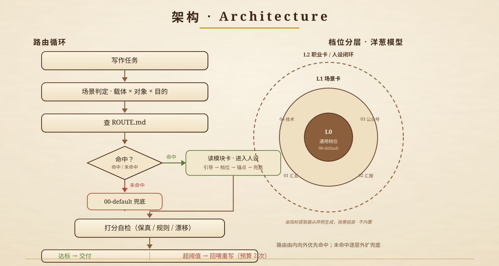

<p align="center">
  
</p>

<h1 align="center">Scene Express · 场景化表述路由</h1>

<p align="center">
  一本「羊皮人设笔记本」：按场景给 AI 一页人设，让它在对的场合，说对的话。<br>
  <b>限制是写不完的，引导比限制更有效。</b>
</p>

<p align="center">
  
  
</p>

---

## 为什么做这个

写出来的内容总有股"AI 味"？自造词汇、句式复杂不常用、永远站在解释的角度说话——这些毛病反复出现，又没法一次说清。

与其写一份永远写不完的"禁用词清单"，不如换一种思路：

> **不同场合，AI 应该有不同表述。** 工作汇报要短句零情绪、只留决策信息；公众号文章要有观点有节奏；技术文档要准确到能照着做对。

Scene Express 就是一本**羊皮人设笔记本**——每一页是一张"人设卡"，写进一个场景里"谁在说话、怎么说"。写作时先查场景，再翻到那一页，按这一页的人设开口。

---

## 核心理念

| 理念 | 含义 |
|---|---|
| **引导 > 限制** | 人设与表达倾向管效果（覆盖约 80%），兜底限制只管底线 |
| **人设即约束** | 先进入人设再写作，人设是结构性约束，不是风格装饰 |
| **一场景一页** | 路由表匹配场景，命中只读一页，使用轻量 |
| **只改怎么说，不改说什么** | 保真护栏全场景生效，不编造事实、数字、来源 |
| **打分循环，而非硬闸口** | 扣分项允许少量容忍，累计超阈值才重写；是无限调优，不是一刀切 |

---

## 特性

- **🗂 场景路由**：载体 × 对象 × 目的三维判定，命中模块卡只读一页；未命中自动兜底，绝不崩。
- **📖 人设模块卡**：每卡 = 人设 + 表达倾向 + 参数档位 + 示例锚点 + 兜底限制 + 校验区。普通 Markdown，用户可自定义增删。
- **🔍 指标提取器**：给你 3–5 篇"写得对"的样例，逆向提取 13 项表述指标，自动生成模块卡。
- **⚖️ 打分循环**：保真维（零容忍）+ 场景规则维 + 风格漂移维三维打分，扣分原因回喂重写。
- **🧅 洋葱分层**：L0 通用档位 → L1 场景卡 → L2 职业卡/人设闭环（提取器自组装），由内向外兜底。
- **🧷 示例锚点**：每卡内置 1–2 段该场景示范文本，比抽象描述更有效，且抗过时。
- **📏 参数档位化**：句长/情绪/词汇等用档位值（短/中/长、零/克制/放开），可机器校验。
- **🛡 保真护栏**：只改"怎么说"，不改"说什么"；不编造事实、数字、来源、立场。

---

## 快速开始

### 安装

将本仓库克隆（或复制）到你的 Skill 目录：

```bash
git clone https://github.com/TEXXXXTURE/scene-express.git
# 将 scene-express 放入你的 Agent / Skill 加载目录
```

### 使用

写作任务开始时，Skill 自动执行路由循环：

1. **场景判定**：载体（汇报/文章/文档…）× 对象（领导/同事/公众…）× 目的（决策/传达/说服…）
2. **查路由**：打开 `routes/ROUTE.md` 匹配模块卡
3. **翻页执行**：按命中页的 人设 → 表达倾向 → 档位 → 锚点 → 兜底 写作
4. **打分自检**：交付前按该页校验区打分，未达标自动重写

> 例："帮我总结这周收集的资料" → 命中 `01-data-summary`（资深同事交班报告）。
> "给领导写本周周报" → 命中 `02-work-report`（短句零情绪，只留决策信息）。

### 定制：用你的样例建一页新的人设卡

```text
给 Agent 的指令：
"这 5 篇文章是我认为写得对的风格。请用 tools/extractor.md 提取指标，
生成一张模块卡，我确认后写入 routes/modules/。"
```

提取器会逐篇拆解 → 跨篇浓缩 → 数值翻译 → 人设推断 → 出卡草稿，**每一项指标都带原文证据**，你确认后才落盘。

---

## 文件结构

```
scene-express/
├── SKILL.md                 协议主文件：路由循环 + 提取协议 + 打分循环
├── routes/
│   ├── ROUTE.md             路由索引表（Agent 查表处）
│   └── modules/             人设模块卡库
│       ├── 00-default.md    默认兜底：直接、克制、专业
│       ├── 01-data-summary.md   资料汇总 → 资深同事交班报告
│       ├── 02-work-report.md    工作汇报 → 短句零情绪，只留决策信息
│       ├── 03-public-article.md 公众号文章 → 半成品模板（人设由你填）
│       └── 04-tech-doc.md       技术文档 → 准确优先，照着能做对
├── tools/
│   ├── extractor.md         指标提取器：样例 → 模块卡
│   └── checker.md           交付打分自检（打分循环）
└── shared/
    ├── metrics.md           ★ 13 项指标词典（提取与校验共用）
    ├── safeguards.md        通用保真护栏
    └── lexicon.md           通用 AI 词表（按场景启用子集）
```

---

## 架构

<p align="center">
  
</p>

### 路由循环

```
写作任务
  ↓
场景判定（载体 × 对象 × 目的）
  ↓
查 ROUTE.md ──命中──▶ 读模块卡，进入人设，按 引导→档位→锚点→兜底 写作
  │                        ↓
  未命中                 打分自检（checker）
  ↓                        ↓
00-default 兜底          达标 → 交付
                         未达标 → 回喂扣分原因 → 重写（预算 2 次）
```

### 洋葱分层

| 层 | 内容 | 状态 |
|---|---|---|
| **L0 通用档位** | 严谨效率型 / 开放创造型 / 默认兜底 | ✅ 内置 |
| **L1 场景卡** | 汇总 / 汇报 / 公众号 / 技术文档 | ✅ 内置 |
| **L2 职业卡 / 人设闭环** | 产品经理、某账号作者…由样例生成 | ⚙️ 提取器自组装，不内置 |

---

## 指标词典（13 项）

提取与校验共用一套指标（`shared/metrics.md`），覆盖 6 个维度：

| 维度 | 指标 |
|---|---|
| 信息 | 结论位置 · 信息密度 |
| 句法 | 平均句长 · 句长方差 |
| 词汇 | 常用词占比 · AI 词命中 |
| 语气 | 情绪词密度 · 人称频率 |
| 结构 | 段落方差 · 小标题密度 |
| 修辞 | 解释腔频率 · 升华/金句频率 · 残留检测 |

---

## 示例：同一件事，两种说法

**任务**：总结最近收集的行业资料

> ❌ 模板腔
> "在当今快速发展的时代，我们收集了大量宝贵资料。首先……此外……总而言之……"

> ✅ 资深同事式（`01-data-summary`）
> "这批材料集中在三件事上：A 的市场规模、B 的竞品策略、C 的监管动向。B 部分最有价值——四份材料互相印证了同一结论；A 部分数据口径不一，需要再核；C 目前只有二手报道，缺一手文件。"

---

## 路线图

- [x] 场景层（L0 + L1）五张模块卡
- [ ] 指标提取器真实样例验收（阶段 E）
- [ ] L2 职业卡组装示例（产品经理 / 公众号作者）
- [ ] 扩展场景：企业 IM / 邮件、小红书、知乎、私人表达
- [ ] 英文版 README

---

## License

[MIT](./LICENSE) © 2026 TEXXXXTURE

*一本羊皮人设笔记本。翻到对的页，说对的话。*
